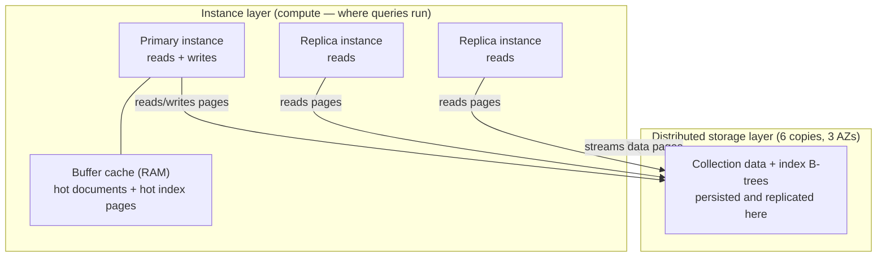
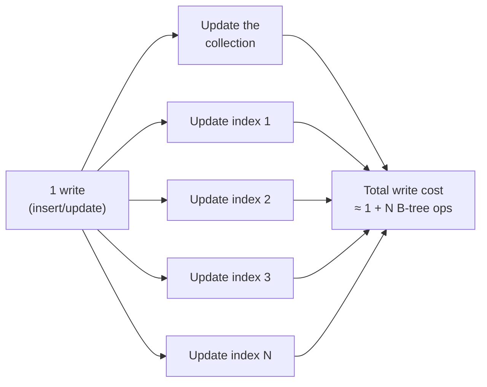
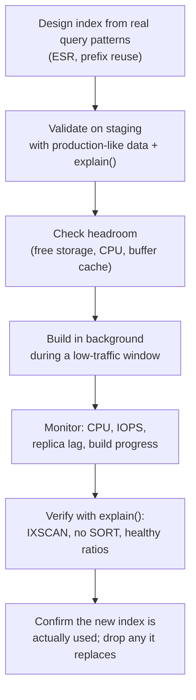
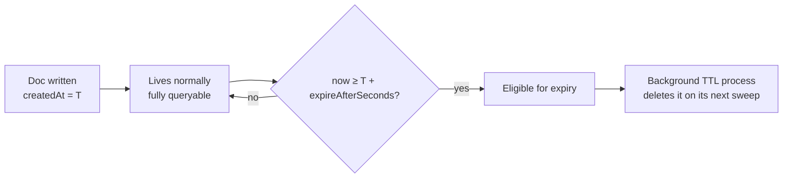
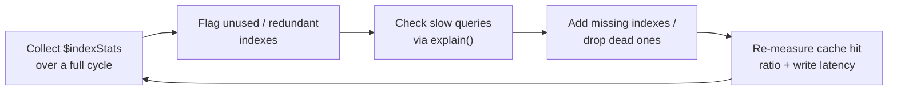

# DocumentDB Indexing — From Fundamentals to Production

> A practical, ground-up guide to indexing in Amazon DocumentDB.
> Starts from "what even is an index" and ends at production concerns:
> query plans, the ESR rule, working-set sizing, write amplification,
> TTL cleanup, and online index builds.

---

## Table of Contents

1. [What is an index?](#1-what-is-an-index)
2. [Why indexes matter](#2-why-indexes-matter-collscan-vs-ixscan)
3. [How indexes actually work (B-trees)](#3-how-indexes-actually-work-b-trees)
4. [The DocumentDB indexing model](#4-the-documentdb-indexing-model)
5. [Index types in DocumentDB](#5-index-types-in-documentdb)
6. [Designing compound indexes — the ESR rule](#6-designing-compound-indexes--the-esr-rule)
7. [Reading query plans with `explain()`](#7-reading-query-plans-with-explain)
8. [Covered queries](#8-covered-queries)
9. [Selectivity and cardinality](#9-selectivity-and-cardinality)
10. [The cost side: writes, storage, and memory](#10-the-cost-side-writes-storage-and-memory)
11. [Building indexes in production](#11-building-indexes-in-production)
12. [TTL indexes deep dive](#12-ttl-indexes-deep-dive)
13. [Monitoring and maintenance](#13-monitoring-and-maintenance)
14. [Anti-patterns and a review checklist](#14-anti-patterns-and-a-review-checklist)
15. [Worked examples](#15-worked-examples)
16. [Quick reference cheat sheet](#16-quick-reference-cheat-sheet)

---

## 1. What is an index?

An **index** is a separate, sorted data structure that lets the database
find documents *without reading every document in the collection*.

The classic analogy is the index at the back of a textbook. If you want
every page that mentions "eviction policy," you have two options:

- **No index:** flip through all 900 pages, one by one, scanning for the word.
- **With index:** jump to the back, find "eviction policy → pp. 412, 588,"
  and go straight there.

The book index is *smaller* than the book, *sorted* alphabetically, and it
stores **a key (the term) plus a pointer (the page number)** — not the whole
page. A database index is exactly this: sorted keys plus pointers to the
full documents.

```
           COLLECTION (the "book")                     INDEX (the "back-of-book index")
   ┌───────────────────────────────────┐        ┌──────────────────────────────────────┐
   │ { _id: 1, userId: "u9", ... }      │        │  key (sorted)      →  pointer         │
   │ { _id: 2, userId: "u3", ... }      │        │  ─────────────────────────────────   │
   │ { _id: 3, userId: "u9", ... }      │  <───  │  "u1"  → doc @ 7                      │
   │ { _id: 4, userId: "u1", ... }      │        │  "u3"  → doc @ 2                      │
   │ { _id: 5, userId: "u3", ... }      │        │  "u9"  → doc @ 1, doc @ 3            │
   │ ...  (millions of docs) ...        │        │  ...                                  │
   └───────────────────────────────────┘        └──────────────────────────────────────┘
      Big, unordered on disk                         Small, sorted, cache-friendly
```

Two properties do all the heavy lifting:

1. **It's sorted.** Sorted data can be searched with binary search
   (halving the search space each step) instead of a linear scan.
2. **It's small.** It stores only the indexed field(s) + a pointer, so far
   more of it fits in RAM than the full collection would.

---

## 2. Why indexes matter (COLLSCAN vs IXSCAN)

Consider a `products` collection with **10,000,000** documents and a query:

```js
db.products.find({ sku: "SKU-8F3C-00042" })
```

### Without an index — a collection scan (`COLLSCAN`)

The engine reads **every** document and checks whether `sku` matches. On
average it touches ~5,000,000 documents for a hit, and *all* 10,000,000 for
a miss. Cost grows linearly with collection size — **O(n)**.

### With an index on `sku` — an index scan (`IXSCAN`)

The engine binary-searches the sorted index, finds the key in a handful of
hops, follows the pointer, and returns the document. Cost grows with the
*logarithm* of collection size — **O(log n)**.

```
Documents examined to find one row, by collection size:

   size        COLLSCAN (~n)         IXSCAN (~log n, B-tree)
   ─────────────────────────────────────────────────────────
   10 K            10,000                    ~2
   1 M          1,000,000                    ~3
   10 M        10,000,000                    ~3–4
   100 M      100,000,000                    ~4

The COLLSCAN column explodes. The IXSCAN column barely moves.
```

This is the single most important reason to index: **query cost stops
tracking data volume.** A well-indexed lookup on a billion-row collection is
about as fast as on a thousand-row one.

The flip side — and the theme of the second half of this guide — is that
indexes are **not free**. They consume storage, they consume RAM, and they
make every write do more work. Indexing is an engineering trade-off, not a
"turn it all on" switch.

---

## 3. How indexes actually work (B-trees)

DocumentDB indexes are **B-tree** indexes (specifically B+‑tree variants).
Understanding the shape explains almost every performance rule that follows.

A B-tree keeps keys **sorted** and **balanced**: every leaf is the same
distance from the root, so every lookup costs the same small number of hops.

```
                         ┌─────────────────────┐
             ROOT        │      [ m  |  t ]     │
                         └───┬────────┬─────┬───┘
                  < m       │    m..t │     │  > t
              ┌─────────────┘         │     └─────────────┐
              ▼                       ▼                    ▼
       ┌────────────┐         ┌────────────┐        ┌────────────┐
 INTERNAL [c | f | i]         [ n |  q  ]           [ v  |  y ]
       └──┬──┬──┬──┬─┘        └──┬──┬──┬──┘         └──┬──┬──┬──┘
          ▼  ▼  ▼  ▼             ▼  ▼  ▼               ▼  ▼  ▼
       ┌───────────────────────────────────────────────────────┐
 LEAVES │ a→ b→ c→ ... → m → n → ... → t → ... → y → z          │  (sorted, linked)
       └───────────────────────────────────────────────────────┘
             each leaf entry = key value + pointer to the full document
```

Three consequences you will rely on constantly:

- **Point lookups are cheap.** Walk root → internal → leaf: 3–4 hops even for
  hundreds of millions of keys.
- **Range and sort come for free.** Because leaves are sorted and linked,
  `age > 30`, `createdAt` between two dates, or `sort({ createdAt: 1 })` are
  just a *walk along the leaves* — no separate sort step.
- **Only left-anchored prefixes are usable.** A B-tree is sorted by the
  first key, then the second, and so on (like a phone book sorted by last
  name, then first name). You can search "everyone named Patel" efficiently,
  but "everyone whose *first* name is Anita, any last name" forces a scan.
  This is the **prefix rule**, and it governs compound-index design
  (Section 6).

> **Mental model:** an index is a phone book. Sorted by the columns you built
> it on, in that order. Anything you can answer by *flipping to a spot and
> reading forward* is fast. Anything that needs the whole book is not.

---

## 4. The DocumentDB indexing model

DocumentDB is **MongoDB-API-compatible** but is *not* MongoDB under the hood —
it's a distinct AWS engine with a **decoupled storage and compute**
architecture. That distinction matters for how you reason about indexes.



Practical implications of this design:

- **Indexes live in the shared storage layer** and are replicated
  automatically (six copies across three AZs). You don't manage index
  replication yourself.
- **Performance is dominated by the instance buffer cache.** A query is fast
  when the index pages *and* the documents it needs are already in the
  instance's RAM. If they must be fetched from the storage layer, latency
  jumps. This is why **"keep your working set (hot data + hot indexes) in
  RAM"** is the #1 sizing rule — it drives your instance-class choice far
  more than raw CPU.
- **Every index you add competes for that same finite buffer cache.** An
  unused index isn't neutral; its pages can evict pages you actually need.
- **Replicas share the same storage**, so an index you create is instantly
  available to all replicas — there's no per-replica rebuild.

> **Version note:** DocumentDB ships as MongoDB-compatible versions (e.g. 4.0,
> 5.0) and as instance-based vs. elastic (sharded) clusters. Supported index
> types, limits, and `explain()` output differ across these. Treat the
> specifics below as a strong default, but **confirm against your cluster's
> version docs and your own `explain()` output** — that's the source of truth.

---

## 5. Index types in DocumentDB

### 5.1 The `_id` index (always present)

Every collection has a **unique** index on `_id`, created automatically. You
can't drop it and you can't make it non-unique. Lookups by `_id` are always
indexed.

### 5.2 Single-field index

Indexes one field. Direction (`1` asc / `-1` desc) is irrelevant for a
single-field index because a B-tree can be walked in either direction.

```js
db.products.createIndex({ sku: 1 })
```

### 5.3 Compound index

Indexes multiple fields **in a specified order**. The order is the whole
game — see Section 6.

```js
db.user_message_status.createIndex({ userId: 1, read: 1, updatedAt: -1 })
```

### 5.4 Multikey index (arrays)

If an indexed field holds an array, DocumentDB creates a **multikey** index:
one index entry *per array element*, so you can match documents by any
element.

```js
// doc: { _id: 1, tags: ["electronics", "sale", "featured"] }
db.products.createIndex({ tags: 1 })
db.products.find({ tags: "sale" })   // uses the index
```

Caveat: you **cannot** create a compound index across *two* array fields
(that would be a combinatorial explosion). At most one indexed field per
compound index may be an array.

### 5.5 Unique index

Rejects duplicate key values — your database-level guarantee of uniqueness.

```js
db.users.createIndex({ email: 1 }, { unique: true })
```

Combine with a partial filter (5.7) to enforce uniqueness only on a subset.

### 5.6 Sparse index

Indexes **only documents that contain the field.** Documents missing the
field are omitted from the index — smaller index, but it can't answer
queries that need to find the missing-field documents.

```js
db.products.createIndex({ promoCode: 1 }, { sparse: true })
```

### 5.7 Partial index

More flexible than sparse: index **only documents matching a filter
expression.** Great for indexing just the "interesting" slice of a large
collection.

```js
// Only index products that are actively listed.
db.products.createIndex(
  { category: 1, brand: 1 },
  { partialFilterExpression: { status: "active" } }
)
```

A query can use a partial index **only if its filter guarantees the
documents are in the index** — i.e. the query must also constrain
`status: "active"` (or a subset).

### 5.8 TTL index

A single-field index on a Date that lets DocumentDB **auto-delete** expired
documents. Covered in depth in Section 12.

```js
db.sessions.createIndex({ createdAt: 1 }, { expireAfterSeconds: 3600 })
```

### 5.9 Text and geospatial indexes

- **Text indexes** (`$text` search) and **`2dsphere` geospatial** indexes are
  supported in newer DocumentDB versions, but with a narrower feature set
  than MongoDB. If you need serious full-text search — ranking, fuzzy
  matching, edge-ngram autocomplete — that belongs in a dedicated search
  engine (OpenSearch), with DocumentDB as the source of truth, rather than
  DocumentDB text indexes.

### 5.10 What is *not* supported

Don't design around these — they're either unsupported or version-limited on
DocumentDB:

- **Hashed indexes** — not supported.
- **Wildcard indexes** — support is limited/version-dependent; don't rely on
  them as a substitute for modelling your access patterns.
- **Reliable index intersection** — DocumentDB generally chooses **one index
  per query**. Don't assume it will combine two single-field indexes to
  satisfy an AND. **Design one compound index** for the access pattern
  instead. (Always confirm with `explain()`.)

```
Support at a glance (verify against your version):

  ✅ _id          ✅ single-field   ✅ compound      ✅ multikey (arrays)
  ✅ unique       ✅ sparse         ✅ partial       ✅ TTL
  🟡 text         🟡 2dsphere       🟡 wildcard      ❌ hashed
  ❌ dependable index intersection (design compound indexes instead)
```

---

## 6. Designing compound indexes — the ESR rule

Compound indexes are where most real performance is won or lost. The field
**order** determines which queries the index can serve, because of the prefix
rule from Section 3.

### The prefix rule

An index on `{ a: 1, b: 1, c: 1 }` can serve queries that use a
**left-anchored prefix** of its keys:

```
Index: { a, b, c }

  Query uses...            Index usable?
  ───────────────────────────────────────
  a                        ✅  (prefix: a)
  a, b                     ✅  (prefix: a, b)
  a, b, c                  ✅  (full)
  a, c                     🟡  a via index, c filtered after
  b                        ❌  b is not a left prefix → scan
  b, c                     ❌  scan
  c                        ❌  scan
```

So one well-ordered compound index quietly replaces several single-field
indexes — as long as you lead with the right field.

### The ESR rule (Equality, Sort, Range)

To order the fields, use **ESR**: put **E**quality fields first, then the
field(s) you **S**ort on, then **R**ange fields last.

```
        ┌──────────────┐   ┌──────────────┐   ┌──────────────┐
        │   EQUALITY   │ → │     SORT     │ → │    RANGE     │
        │  x == value  │   │  order by y  │   │  z > / < ... │
        └──────────────┘   └──────────────┘   └──────────────┘
         most selective     lets the index      widest scan,
         narrows fast       return rows          must come last
                            already sorted
```

**Why this order?**

- **Equality first** jumps you to the exact slice of the B-tree that matches,
  shrinking the search space immediately.
- **Sort next** means the index leaves are *already* in your sort order — the
  engine walks them directly and skips a separate in-memory `SORT` stage
  (which is the thing that blows up memory and latency on large result sets).
- **Range last** because a range "opens up" the tree; any field placed *after*
  a range can no longer be used to narrow or to sort, so ranges must be the
  final key.

### Worked example

```js
// Query: unread messages for one user, newest first.
db.user_message_status
  .find({ userId: "u9", read: false, updatedAt: { $gte: cutoff } })
  .sort({ updatedAt: -1 })
```

- Equality: `userId`, `read`
- Sort: `updatedAt` (desc)
- Range: `updatedAt` (`$gte`)

Here the sort field *is* the range field, so:

```js
db.user_message_status.createIndex({ userId: 1, read: 1, updatedAt: -1 })
```

This index: (1) jumps straight to `userId="u9", read=false`, (2) returns rows
already in `updatedAt: -1` order (no sort stage), and (3) applies the range as
a bounded walk along the leaves. That's the ideal shape — an IXSCAN with no
FETCH-then-SORT tax.

> **Prefix reuse tip:** the same index also serves `find({ userId })` and
> `find({ userId, read })`. Design the *longest* compound index your key
> access patterns need, and let shorter prefixes ride on it — instead of
> creating three overlapping indexes.

---

## 7. Reading query plans with `explain()`

You never *guess* whether an index is used — you check. `explain()` shows the
plan the optimizer chose.

```js
db.user_message_status
  .find({ userId: "u9", read: false })
  .sort({ updatedAt: -1 })
  .explain("executionStats")
```

### Stages you'll see, and what they mean

```
  IXSCAN        ✅ index scan — walked the B-tree. Good.
  COLLSCAN      🚩 collection scan — read everything. Usually a red flag
                   on a large collection.
  FETCH         Retrieved full documents via pointers from the index.
                   Normal, but a huge FETCH count vs. returned count hints
                   at a low-selectivity index.
  SORT          🚩 in-memory sort. Means the index did NOT provide order.
                   On large result sets this is slow and memory-hungry;
                   reorder the compound index (ESR) to eliminate it.
  LIMIT / SKIP  Bounded the result set.
```

### The three numbers that matter

In `executionStats`, compare:

- **`nReturned`** — documents returned.
- **`totalKeysExamined`** — index entries read.
- **`totalDocsExamined`** — documents read.

```
  Healthy:    nReturned ≈ totalKeysExamined ≈ totalDocsExamined
              (you touched roughly as much as you returned)

  Unhealthy:  totalDocsExamined  ≫  nReturned
              (you read a mountain to return a handful → poor selectivity,
               wrong index, or a COLLSCAN in disguise)
```

If you scanned 2,000,000 docs to return 50, the index isn't doing its job —
revisit field order, selectivity, or whether the right index exists at all.

### Forcing an index with `hint()`

If the planner picks a worse index, you can override it — but treat this as a
diagnostic, not a permanent fix. A needed `hint()` usually means the *index
design* is wrong.

```js
db.orders.find({ ... }).hint({ userId: 1, status: 1, createdAt: -1 })
```

---

## 8. Covered queries

A **covered query** is answered *entirely from the index* — the engine never
touches (`FETCH`es) the full documents, because every field the query needs
is already in the index. This is the fastest possible read.

Requirements:

1. Every field in the **filter** is in the index.
2. Every field the query **returns** is in the index.
3. You **exclude `_id`** in the projection (unless `_id` is in the index).

```js
db.user_message_status.createIndex({ userId: 1, read: 1 })

// Covered: filter fields and returned fields are all in the index.
db.user_message_status.find(
  { userId: "u9", read: false },
  { _id: 0, userId: 1, read: 1 }
)
```

```
  Normal indexed query:   IXSCAN ──► FETCH ──► return
                          (index)   (docs)

  Covered query:          IXSCAN ─────────────► return
                          (never fetches documents — much cheaper)
```

Covered queries shine for hot count/existence checks and dashboard-style
lookups. The trade-off: adding fields to an index purely to cover a query
makes the index bigger, so cover the *hot* paths, not everything.

---

## 9. Selectivity and cardinality

**Selectivity** = how effectively an index narrows the result set. High
selectivity is what makes an index worth having.

- **High cardinality / high selectivity:** `sku`, `email`, `userId` — many
  distinct values, each matching few documents. *Excellent* index candidates.
- **Low cardinality / low selectivity:** `isActive` (2 values), `status`
  (5 values). A standalone index on a boolean often isn't worth it — matching
  "half the collection" via an index is slower than a scan, and the planner
  may skip the index entirely.

```
  Field: sku        distinct values: ~10,000,000   → each key ≈ 1 doc   ✅ index
  Field: status     distinct values: 5             → each key ≈ 2M docs  🟡 weak alone
  Field: isDeleted  distinct values: 2             → each key ≈ 5M docs  ❌ poor alone
```

Low-cardinality fields still earn their place **inside a compound index** as
the *equality* prefix that precedes a selective sort/range — e.g.
`{ read: 1, updatedAt: -1 }` where `read` alone is useless but pairs well with
an ordered `updatedAt`. Or use a **partial index** so you only index the slice
you query (Section 5.7).

---

## 10. The cost side: writes, storage, and memory

Indexes accelerate reads by **taxing writes and consuming resources.** Every
index is a standing cost. This is why "index everything" is an anti-pattern.

### Write amplification

Each `insert`/`update`/`delete` must update **every index** whose keys are
affected — each update is an additional B-tree modification.



A collection with 8 indexes does roughly 8× the index maintenance work per
write. On write-heavy workloads (bulk ingest, high-throughput event pipelines,
the source-of-truth collection behind a sync worker) this directly caps your
write throughput. **Every index is a write tax; keep only the ones that pay
for themselves in reads.**

### Storage

Indexes are stored data. A high-cardinality compound index over a large
collection can rival the collection's own size. Storage is billed, and — more
importantly — it competes for buffer cache.

### Memory / working set (the big one)

Because DocumentDB reads are fast only when pages are in the instance buffer
cache, your **working set** — hot documents + hot index pages — should fit in
RAM. Every extra index:

- adds pages that may need to be cache-resident, and
- can **evict** pages you actually need, quietly slowing *other* queries.

```
  Buffer cache (instance RAM) — finite:

   ┌───────────────────────────────────────────────┐
   │ hot docs │ idx A │ idx B │ idx C │ idx D(unused)│  ← D wastes cache,
   └───────────────────────────────────────────────┘     evicts useful pages
                                     ▲
              an unused index isn't free — it's actively harmful here
```

**Rule of thumb:** if an index isn't used by a real query path, it's pure
cost. Find and drop it (Section 13).

### Bulk deletes and index maintenance

Deleting N documents also deletes N entries from *every* index — one reason
large deletes are heavy. Doing them in **batches** (with a small pause between
batches) keeps index-maintenance load and replication traffic smooth instead
of spiky, and avoids long-running operations. For data that expires on a
schedule, a **TTL index** (Section 12) offloads the deletion entirely.

---

## 11. Building indexes in production

Creating an index on a large, live collection is a heavy operation — it reads
the whole collection and builds the B-tree.

### Blocking vs. background

- A **foreground** build can block operations on the collection — never do
  this on a hot production collection.
- Use a **background build** so the collection stays available during the
  build:

```js
db.products.createIndex({ category: 1, brand: 1, createdAt: -1 }, { background: true })
```

### Production build workflow



Extra guidance:

- **Build during low traffic.** The build competes with live queries for CPU,
  IOPS, and cache.
- **Watch replica lag** during the build.
- **Ensure free storage** before you start — a large index needs room.
- **One at a time** on a given collection; parallel builds multiply load.
- **Verify, then prune.** After the new index proves useful in `explain()`,
  drop any older index it supersedes (a longer compound index often makes a
  shorter one redundant — see prefix reuse).

---

## 12. TTL indexes deep dive

A **TTL (time-to-live) index** auto-expires documents after a set age. Perfect
for sessions, short-lived caches-of-record, ephemeral status rows, logs, and
any "delete after N seconds" data — it removes the need for your own delete
job.

```js
// Expire session docs 1 hour after createdAt.
db.sessions.createIndex({ createdAt: 1 }, { expireAfterSeconds: 3600 })
```



Key rules and gotchas:

- **The indexed field must be a `Date`** (or an array of Dates → expiry uses
  the *earliest*). Non-date values are ignored and never expire.
- **Deletion is not instant.** A background process sweeps periodically, so
  documents can linger past their expiry before removal. Don't rely on TTL for
  precise, to-the-second deletion.
- **TTL indexes are single-field only.** You can't put a TTL on a compound
  index.
- **`expireAfterSeconds` is offset from the field's value**, not from write
  time — so backfilled data with old `createdAt` values expires immediately.
- To expire at an **absolute time** instead of an offset, set
  `expireAfterSeconds: 0` and store the exact expiry moment in the indexed
  Date field.
- TTL deletes still incur normal delete + index-maintenance cost, but they're
  spread out by the background sweep rather than arriving as one big batch —
  which is exactly why they're gentler than a bulk delete.

---

## 13. Monitoring and maintenance

Indexes are living infrastructure. Review them like any other resource.

### Find unused indexes

`$indexStats` reports how often each index has been used (the `accesses.ops`
counter) since the instance started:

```js
db.user_message_status.aggregate([{ $indexStats: {} }])
```

- An index with a near-zero `ops` count over a representative window is a
  **drop candidate** — pure write/storage/cache cost with no read benefit.
- Let counters accumulate across a **full traffic cycle** (include weekly and
  monthly jobs) before concluding an index is dead.

### Inspect and manage indexes

```js
db.user_message_status.getIndexes()          // list all indexes
db.user_message_status.dropIndex("name_1")   // remove one
db.collection.totalIndexSize()               // where supported, gauge index size
```

### What to watch in CloudWatch

```
  BufferCacheHitRatio   ← should stay high; drops mean working set > RAM
  CPUUtilization        ← spikes during builds and heavy scans
  ReadIOPS / WriteIOPS  ← cache misses and index maintenance show up here
  DatabaseConnections   ← unrelated to indexes but always worth watching
  ReplicaLag            ← climbs during index builds / bulk writes
```

A falling **buffer cache hit ratio** is often the earliest signal that you've
either outgrown your instance class or accumulated too many indexes competing
for RAM.

### A periodic review loop



---

## 14. Anti-patterns and a review checklist

### Common anti-patterns

- **Indexing everything "just in case."** Every index taxes writes and cache.
  Index for *known* query paths.
- **Redundant overlapping indexes.** `{a}` and `{a,b}` and `{a,b,c}` — often
  the longest one plus prefix reuse is enough. Keep the superset, drop subsets
  it covers.
- **Wrong compound order.** Violating ESR leaves a `SORT` stage in the plan or
  makes the index unusable. Order = Equality, Sort, Range.
- **Leading with a low-cardinality field** as a *standalone* index (e.g. a
  boolean) — weak selectivity, planner may ignore it.
- **Foreground builds on hot collections** — can block the collection.
- **Assuming index intersection** — DocumentDB won't reliably AND two indexes;
  build the compound.
- **TTL on a non-Date field** — silently never expires.
- **Never running `explain()`** — flying blind. The plan is the ground truth.

### Pre-ship checklist for a new index

```
  [ ] Backed by a real, observed query pattern (not hypothetical)?
  [ ] Compound field order follows ESR (Equality → Sort → Range)?
  [ ] Leading field is selective enough (or it's a deliberate equality prefix)?
  [ ] Can existing indexes / prefixes already serve this? (avoid duplicates)
  [ ] Verified with explain(): IXSCAN, no SORT, nReturned ≈ docsExamined?
  [ ] Write-throughput impact acceptable for this collection?
  [ ] Working set (hot docs + this index) still fits in the buffer cache?
  [ ] For expiring data: is a TTL index the better tool than a delete job?
  [ ] Build planned in background, low-traffic window, with headroom to spare?
```

---

## 15. Worked examples

### Example A — per-user read/unread status

Access patterns:

1. Unread messages for a user, newest first.
2. All messages for a user (read or unread), newest first.
3. Upsert a status row keyed by `(userId, messageId)`.

```js
// Serves (1) and, by prefix, (2). Equality: userId, read. Sort/Range: updatedAt.
db.user_message_status.createIndex({ userId: 1, read: 1, updatedAt: -1 })

// Enforces the compound key for upserts and guarantees one row per pair.
db.user_message_status.createIndex({ userId: 1, messageId: 1 }, { unique: true })
```

`find({ userId })` reuses the prefix of the first index — no third index
needed. Confirm both with `explain("executionStats")` and check for the
absence of a `SORT` stage on pattern (1).

### Example B — product catalog filters

Access pattern: browse **active** products by category/brand, newest first.

```js
db.products.createIndex(
  { category: 1, brand: 1, listedAt: -1 },
  { partialFilterExpression: { status: "active" } }
)
```

The **partial filter** keeps the index small (only active products), and ESR
ordering (equality on category/brand, then the `listedAt` sort) means results
come back pre-sorted. Queries must include `status: "active"` to use it.

### Example C — ephemeral sessions

```js
db.sessions.createIndex({ token: 1 })                                // lookups
db.sessions.createIndex({ createdAt: 1 }, { expireAfterSeconds: 3600 }) // auto-cleanup
```

The TTL index removes the need for a scheduled delete job and spreads deletion
load across the background sweep instead of concentrating it in one bulk purge.

---

## 16. Quick reference cheat sheet

```
CREATE
  db.c.createIndex({ f: 1 })                               single field
  db.c.createIndex({ a: 1, b: 1, c: -1 })                  compound (ESR order)
  db.c.createIndex({ email: 1 }, { unique: true })         unique
  db.c.createIndex({ f: 1 }, { sparse: true })             sparse
  db.c.createIndex({ a: 1 }, {                              partial
      partialFilterExpression: { status: "active" } })
  db.c.createIndex({ ts: 1 }, { expireAfterSeconds: 3600 })TTL (Date field only)
  db.c.createIndex({ a: 1, b: 1 }, { background: true })   background build

INSPECT
  db.c.getIndexes()                                        list indexes
  db.c.aggregate([{ $indexStats: {} }])                    usage counts
  db.c.find(q).explain("executionStats")                   query plan + metrics
  db.c.find(q).hint({ a: 1, b: 1 })                        force an index (diagnostic)

DROP
  db.c.dropIndex("name")                                   remove one index

DESIGN RULES
  ESR            compound order = Equality → Sort → Range
  Prefix         { a, b, c } serves a | a,b | a,b,c (left-anchored only)
  Selectivity    lead with high-cardinality fields (or a deliberate eq prefix)
  Covered        all filter + projected fields in index, exclude _id → no FETCH
  One index      DocumentDB uses one index/query — build the compound
  Working set    hot docs + hot indexes must fit the instance buffer cache
  Write tax      every write updates every affected index (1 + N B-tree ops)
  Verify         explain(): want IXSCAN, no SORT, nReturned ≈ docsExamined

RED FLAGS IN A PLAN
  COLLSCAN on a large collection
  SORT stage present (compound order likely wrong)
  totalDocsExamined ≫ nReturned (poor selectivity / wrong index)
```

---

### Final notes

- **`explain()` is the ground truth.** Every rule here is a heuristic for
  producing a good plan; the plan itself is what you verify and trust.
- **Index for real access patterns**, measure the effect on both reads and
  writes, and prune anything `$indexStats` shows as unused.
- **Version-check the specifics.** Supported index types, limits, and
  `explain()` output vary by DocumentDB version (4.0 / 5.0) and cluster type
  (instance-based vs. elastic/sharded). Confirm the details in this guide
  against your cluster's documentation and your own query plans.
